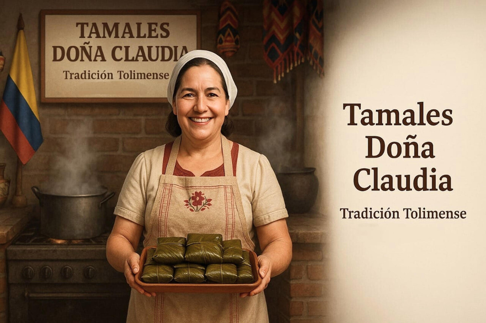

# Elementos Financieros

<!-- 
  font-sans: Inter, ui-sans-serif, system-ui, -apple-system, BlinkMacSystemFont, "Segoe UI", Roboto, "Helvetica Neue", Arial, "Noto Sans", sans-serif, "Apple Color Emoji", "Segoe UI Emoji", "Segoe UI Symbol", "Noto Color Emoji";
  font-serif: ui-serif, Georgia, Cambria, "Times New Roman", Times, serif;
  font-mono: ui-monospace, SFMono-Regular, Menlo, Monaco, Consolas, "Liberation Mono", "Courier New", monospace;
-->

## Tamales Doña Claudia

---
layout: image
# the image source
image: /assets/fondo2.png
---

  <!-- Columna de texto -->
  

    <h2 class="text-4xl font-bold tracking-wide text-blue-900 uppercase mb-6">Integrantes</h2>
    
  <ul class="space-y-5 text-lg text-blue-900 font-medium">
    <li class="flex items-center justify-between border-l-4 border-blue-800 pl-4">
      Buitrago Morales Julio Cesar
      085400502022
    </li>
    <li class="flex items-center justify-between border-l-4 border-blue-800 pl-4">
      Romero Bonilla Cristian Camilo
      085400522022
    </li>
    <li class="flex items-center justify-between border-l-4 border-blue-800 pl-4">
      Vargas Homez Paula Valentina
      085400142022
    </li>
  </ul>
  

  <!-- Imagen decorativa -->
  

    
  

---
layout: image
image: /assets/fondo3.png
class: flex flex-col items-center justify-center px-10 py-12
---
 

  
Tabla de

  <h1 class="text-3xl font-bold leading-tight mt-1 text-[#253754]">Contenido</h1>

<a href="4" class="flex justify-between hover:underline">
  • Antecedentes del Negocio01
</a>

<a href="5" class="flex justify-between hover:underline">
  • Resumen Ejecutivo02
</a>

<a href="6" class="flex justify-between hover:underline">
  • Análisis de Costos de Producción03
</a>

<a href="7" class="flex justify-between hover:underline">
  • Estrucutra de Ingresos04
</a>

<a href="8" class="flex justify-between hover:underline">
  • Gastos Operativos05
</a>

<a href="9" class="flex justify-between hover:underline">
  • Estado de resultados06
</a>

<!-- Sublista de utilidades -->

• Utilidades

<ul class="ml-6 list-disc list-inside space-y-1">
  <li><a href="#utilidad-operativa" class="hover:underline">Utilidad Operativa</a></li>
  <li><a href="#utilidad-impuestos" class="hover:underline">Utilidad Antes de Impuestos</a></li>
  <li><a href="#utilidad-neta" class="hover:underline">Utilidad Neta</a></li>
</ul>

<a href="11" class="flex justify-between hover:underline">
  • Conclusiones08
</a>

---
layout: image
image: /assets/fondo4.png
---

<section id="4" class="grid grid-cols-1 md:grid-cols-2 gap-10 items-center text-[#253754]">

  <!-- Columna izquierda: texto -->
  
  
    <h2 class="text-lg md:text-xl font-light tracking-wide uppercase">Antecedentes</h2>
    <h1 class="text-3xl md:text-4xl font-bold text-[#253754] uppercase">Historia</h1>

  

    Tamales Doña Claudia es una empresa familiar creada en 2010 en la ciudad de Ibagué, inspirada en la tradición gastronómica tolimense.
    Su fundadora, Claudia, heredó de su madre no solo la receta ancestral del tamal, sino también el amor por la cocina y el compromiso con la calidad.
  

  

    A partir de ese legado, decidió emprender un negocio que mantuviera viva esa tradición,
    ofreciendo tamales artesanales elaborados con ingredientes frescos y procesos cuidadosos.
    Hoy en día, la empresa es reconocida a nivel local por preservar el sabor auténtico de los tamales tolimenses y por ser un símbolo de cultura y tradición en la región.
  

  

  <!-- Columna derecha: imagen -->
  

    
  

</section>

---
layout: image
image: /assets/fondo5.png
class: px-8 py-12
---

  Resumen Ejecutivo - Abril 2025

<!-- Panel de Indicadores Principales -->

  <!-- Ingresos Totales -->
  

    

      <h2 class="text-lg font-semibold text-blue-100">Ingresos Totales</h2>
      📈 +11.58%
    

    
$64,000,000

    

      

        Abril 2024:$57,356,000
      

      

        Crecimiento:+$6,644,000
      

    

  

  <!-- Utilidad Neta -->
  

    <h2 class="text-lg font-semibold text-green-100 mb-2">Utilidad Neta</h2>
    
$10,069,496

    
Margen Neto: 15.73%

    

      

    

    

      0%15.73%100%
    

  

<!-- Indicadores Secundarios -->

  

    
6,400

    
Tamales Producidos

  

  

    
$10,000

    
Costo Unitario

  

  

    
46.15%

    
Costos / Ingresos

  

  

    
6.58%

    
Gastos Operativos

  

---
layout: image
image: /assets/fondo10.png
class: px-10 py-12
---

# Análisis de Costos de Producción

<!-- Panel Superior -->

  

    
Costo Total Mensual

    
$29,537,200

    
Producción completa

  

  

    
Unidades Producidas

    
6,400

    
Tamales mensuales

  

  

    
Costo Unitario

    
$10,000

    
Por tamal

  

<!-- Panel Inferior -->

  <!-- Estructura de Costos -->
  

    <h3 class="text-xl font-semibold text-white mb-5">Estructura de Costos</h3>

  

    

      

        Materia Prima
        $8,202,200 (28%)
      

      

        

      

    

  

    

      Mano de Obra
      $21,335,000 (72%)
    

    

      

    

  

  

  

  <!-- Análisis de Eficiencia -->
  

    <h3 class="text-sm font-semibold text-[#253754] mb-2">Análisis de Eficiencia</h3>

  

    

      

        Control de Costos Óptimo
         
        Costo unitario competitivo en el mercado
      

    

  

    

      Distribución Equilibrada
       
      72% mano de obra refleja calidad artesanal
    

  

  

    

      Margen Saludable
       
      Costos representan 46.15% de los ingresos
    

  

  

  

---
layout: image
image: /assets/fondo7.png
---

# Estructura de Ingresos

  

    <!-- Ingresos Principales -->
    

      

        

          <h3 class="text-xl font-bold text-white">Ingresos Operacionales</h3>
          100% Operacional
        

        
  
$64,000,000

  
  

    

      
Promedio Semanal

      
$16,000,000

    

    

      
Promedio Diario

      
$2,133,333

    

  

  <!-- Comparativo Anual -->
  

    <h4 class="text-lg font-medium text-white mb-3">Comparativo Interanual</h4>
    

      

        Abril 2024
        $57,356,000
      

      

        Abril 2025
        $64,000,000
      

      

        Crecimiento
        +$6,644,000 (+11.58%)
      

    

  

  <!-- Métricas Clave -->
  

    

      <h4 class="text-lg font-medium text-white mb-3">Indicadores Clave</h4>
      

        

          
Precio Promedio

          
$10,000

          
Por tamal vendido

        

        

          
Unidades Vendidas

          
6,400

          
Tamales en abril

        

      

    

  

    <h4 class="text-lg font-medium text-white mb-3">Características</h4>
    

      

        

        Ingresos 100% operacionales
      

      

        

        Sin anticipos registrados
      

      

        

        Ventas netas ajustadas
      

    

  

  

  

---
layout: image
image: /assets/fondo10.png
---

# Gastos Operativos

  

    <h3 class="text-xl font-medium text-amber-900 mb-6">Resumen de Gastos</h3>
    
  

    <!-- Columna Izquierda -->
    

      <!-- Servicios Públicos -->
      

        

          Servicios Públicos
          1,700,000 COP
        

        

          

        

      

  <!-- Arriendos -->
  

    

      Arriendos
      1,800,000 COP
    

    

      

    

  

  <!-- Nómina Operativa -->
  

    

      Nómina Operativa
      18,600,000 COP
    

    

      

    

  

  <!-- Columna Derecha -->
  

    <!-- Transporte -->
    

      

        Transporte
        410,000 COP
      

      

        

      

    

  <!-- Mantenimiento -->
  

    

      Mantenimiento
      300,000 COP
    

    

      

    

  

  <!-- Publicidad -->
  

    

      Publicidad
      600,000 COP
    

    

      

    

  

  

  <!-- Total -->
  

    

      Total Gastos
      23,462,750 COP
    

    

      Los gastos operativos representan el 36.66% de los ingresos totales
    

  

  

---
layout: image
image: /assets/fondo4.png
---

 
  Estado de Resultados

  

    <!-- Header -->
    

      <h3 class="text-[0.7rem] font-bold text-white">Estado de Resultados - Abr 2025</h3>
       
      Tamales Doña Claudia S.A.S
    

    
<!-- Contenido -->

<!-- Ingresos -->

  Ingresos Operacionales
  $64.0M

<!-- Costo de Ventas -->

  

    (-) Costo de Ventas
    $29.5M
  

  

    

      • Materia Prima
      $8.2M
    

    

      • Mano de Obra
      $21.3M
    

  

<!-- Utilidad Bruta -->

  Utilidad Bruta
  $34.5M

<!-- Gastos Operacionales -->

  

    (-) Gastos Operacionales
    $4.2M
  

  

    

      • Arriendos
      $1.8M
    

    

      • Servicios
      $1.7M
    

    

      • Transporte
      $410K
    

    

      • Mantenimiento
      $300K
    

  

<!-- Gastos Administrativos -->

  

    (-) Gastos Administrativos
    $18.6M
  

  

    

      • Nómina Admin
      $18.6M
    

  

<!-- Utilidad Operativa -->

  Utilidad Operativa
  $11.7M

<!-- Otros Ingresos y Gastos -->

  

    (+) Otros Ingresos
    $0
  

  
 
    (-) Gastos Financieros
    $1.6M
  

<!-- Utilidad Antes de Impuestos -->

  Utilidad Antes de Impuestos
  $10.1M

<!-- Impuestos -->

  (-) Impuesto Renta (33%)
  $3.3M

<!-- Utilidad Neta -->

  UTILIDAD NETA
  $6.7M

<!-- Margen Neto -->

  

    Margen Neto: 
    15.7%
  

  

---
layout: image
image: /assets/fondo4.png
---

# Utilidades del Periodo

  

    

      Utilidad Bruta
      34,462,800 COP
    

  

  
  

    

      Utilidad Operativa
      11,652,800 COP
    

  

  
  

    

      Antes de Impuestos
      10,069,496 COP
    

  

  
  

    

      Utilidad Neta
      6,746,562 COP
    

  

---
layout: image
image: /assets/fondo4.png
---

# Conclusiones Clave

  

    <h3 class="text-xl font-bold text-white mb-2">Crecimiento Sólido</h3>
    
+11.58% en ventas vs 2024

  

  

    <h3 class="text-xl font-bold text-white mb-2">Rentabilidad</h3>
    
15.73% margen neto

  

  <!-- 

    <h3 class="text-xl font-bold text-white mb-2">Potencial</h3>
    
Listos para escalar operaciones

  
 -->

---
layout: chat-layout
---

  
✨

  <h2 class="text-3xl md:text-5xl font-bold text-white leading-tight mb-8">
    "Cada tamal cuenta una historia.  
    Cada cifra refleja nuestro compromiso."
  </h2>
  
— Tamales Doña Claudia

  
15 años de tradición • Abril 2025

---
layout: image
image: /assets/fondo11.png
class: px-10 py-24
---